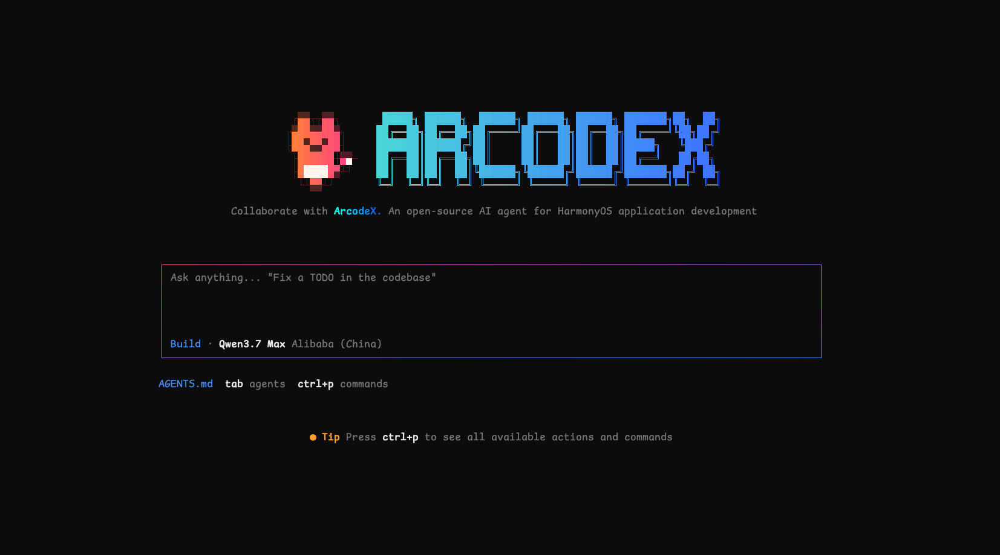

<h1 align="center">ArcodeX</h1>

<p align="center"><strong>An AI Agent for HarmonyOS application development.</strong></p>

<p align="center">
  <a href="https://www.npmjs.com/package/arcodex"></a>
  <a href="https://www.npmjs.com/package/arcodex"></a>
  
  
  <a href="LICENSE"></a>
</p>

<p align="center">
  
</p>

---

## What is this?

**ArcodeX** is built on top of [DevEco Code](https://gitcode.com/openharmony-sig/deveco-code) — a terminal-based AI Agent for HarmonyOS development. It fully preserves DevEco Code's HarmonyOS toolchain integration while adding further improvements and enhancements on top.

---

## Quick Start

```bash
npm install -g arcodex
arcodex
```

---

## HarmonyOS Capabilities

Fully retains DevEco Code's toolchain integration, continuously enhanced on top: Hvigor build, app launch, HDC device logs, UI verification, ArkTS syntax checks, HarmonyOS official knowledge-base search, and simulator / real-device debugging.

> Build and on-device run capabilities require [DevEco Studio](https://developer.huawei.com/consumer/cn/deveco-studio/) to be installed and the `DEVECO_HOME` environment variable to be configured.

---

## Requirements

| Item | Requirement |
|---|---|
| OS | Windows 11 / macOS (Linux not supported) |
| Node.js | 22 or above |
| DevEco Studio | 6.1 or above (recommended) |

---

## Contributing

Issues and Pull Requests are welcome. Please read [CONTRIBUTING.md](CONTRIBUTING.md) before contributing.

## License

[MIT License](LICENSE)
